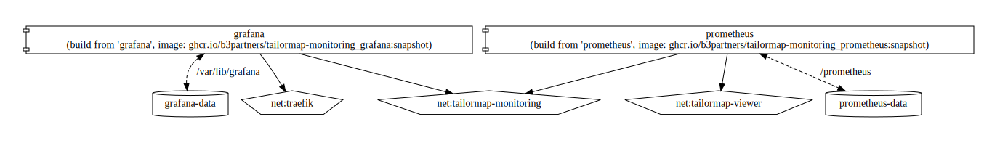

# Tailormap Monitoring

Monitoring stack for Tailormap stacks using Prometheus to scrape the `/api/actuator/prometheus` endpoint of the tailormap-api
and providing Grafana for presentation. Other endpoints in the stack are scraped as well.
_Note that this example uses default passwords, for a secure setup you'll need to check and update at least the passwords!_.

## Deployment

```shell
docker compose -f ./tailormap-monitoring/docker-compose.yml -p tailormap-monitoring up --remove-orphans -d --build --pull=always
```

### diagram



### Environment

For port binding you can use the `docker-compose-ports.yml` together with the `docker-compose.yml` this will expose 2
required environment variables.

```sh
PROMETHEUS_PORT=127.0.0.1:9090:9090
GRAFANA_PORT=127.0.0.1:3000:3000
```

These environment variables can be configured in a `.env` file. Copy the `.env.template` file to `.env` and modify the
variables so you do not have to specify them everytime.

## Prometheus

Prometheus will ask for a change of password when first logging in, the defaults are `admin` / `admin`;
by default no ports are exposed externally

## Grafana

The Grafana admin password is set using the `GF_SECURITY_ADMIN_PASSWORD` environment variable, service host name can be
set using `GF_SERVER_DOMAIN` environment variable. Grafana is setup to be proxied
through Traefik. The default login is `admin` / `admin`.

### documentation

- https://grafana.com/docs/grafana/latest/installation/docker/
- https://grafana.com/docs/grafana/latest/administration/configure-docker/

### TODO

- Provision default dashboards:
    - https://grafana.com/tutorials/provision-dashboards-and-data-sources/
    - https://grafana.com/docs/grafana/latest/administration/provisioning/#dashboards
    - https://stackoverflow.com/questions/63518460/grafana-import-dashboard-as-part-of-docker-compose
    - https://stackoverflow.com/questions/54813704/how-to-add-dashboard-configuration-json-file-in-grafana-image
    - https://github.com/vegasbrianc/prometheus
